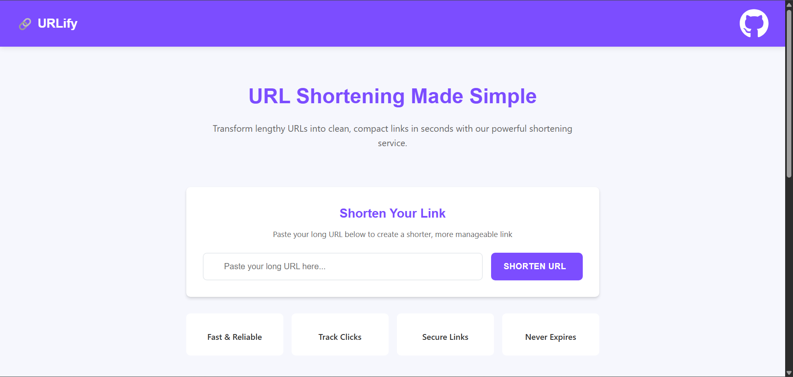

# URL Shortener - URLify

Welcome to the URL Shortener project! This repository houses a complete URL shortener application built with a modern tech stack.

## Table of Contents
- [Overview](#overview)
- [Features](#features)
- [Tech Stack](#tech-stack)
- [Screenshots](#screenshots)
- [Installation](#installation)
- [Usage](#usage)
- [Contributing](#contributing)
- [License](#license)
- [Contact](#contact)

## Overview

This project is a URL shortener application built with **React** on the frontend, **Node.js** and **Express** on the backend, and **MongoDB** as the database. The application allows users to shorten long URLs and provides an intuitive interface to manage and track your links.

## Features

- **Responsive UI:** A modern, intuitive interface built with React.
- **Efficient URL Shortening:** Fast URL generation using Node.js and Express.
- **Data Persistence:** URL mappings and analytics are stored securely in MongoDB.
- **Real-Time Analytics:** Monitor click statistics and URL usage.
- **Easy Setup:** Quick installation and deployment instructions.

## Tech Stack

- **Frontend:** React, HTML, CSS, JavaScript
- **Backend:** Node.js, Express
- **Database:** MongoDB
- **Additional Libraries:** Axios, Mongoose (if applicable)

## Screenshots

Below are some screenshots showcasing the application:

